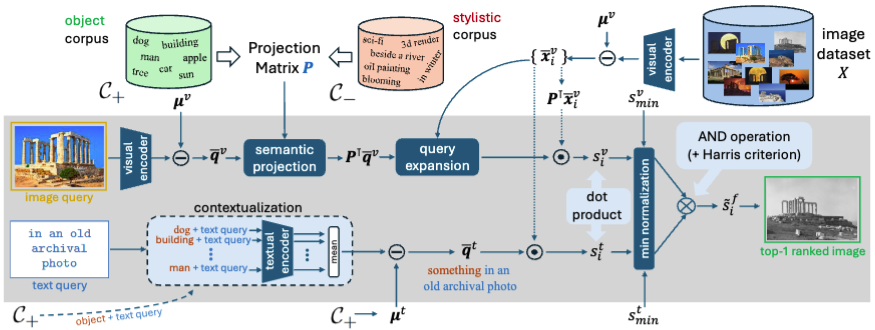
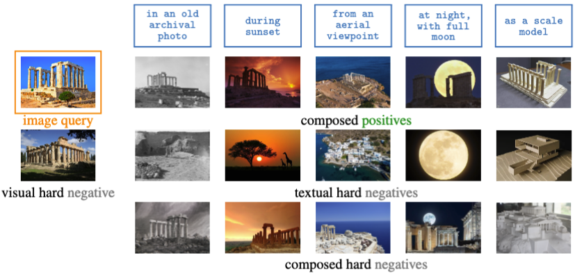
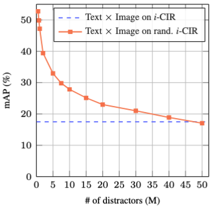
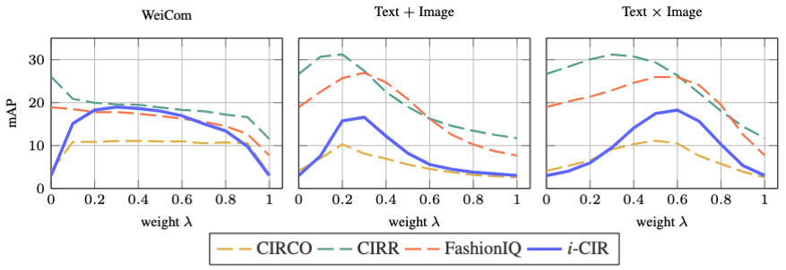

# i-CIR: Instance-Level Composed Image Retrieval (NeurIPS 2025)

[](#)
[](https://creativecommons.org/licenses/by-nc-sa/4.0/)
[](LICENSE)
[](#)

Official implementation of our **B**aseline **A**pproach for **S**urpr**I**singly strong **C**omposition (**BASIC**) and the **i**nstance-level **c**omposed **i**mage **r**etrieval (**i-CIR**) dataset.   
[[`arXiv`](https://arxiv.org/abs/2510.25387)] · [[`paper`](https://openreview.net/pdf?id=7NEP4jGKwA)] · [[`project page`](https://vrg.fel.cvut.cz/icir/)]

**TL;DR**: We introduce **BASIC**, a training-free VLM-based method that centers and projects image embeddings, and **i-CIR**—a curated, instance-level composed image retrieval benchmark with rich hard negatives that is compact yet really hard.

## Overview

This repository contains a clean implementation for performing composed image retrieval (CIR) on **i-CIR** dataset using vision-language models (CLIP/SigLIP). 


### Method (BASIC)

Our BASIC method decomposes multimodal queries into object and style components through:

1. **Feature Standardization**: Centering features using LAION-1M statistics
2. **Contrastive PCA Projection**: Separating information using positive and negative text corpora
3. **Query Expansion**: Refining queries with top-k similar database images
4. **Harris Corner Fusion**: Combining image and text similarities with geometric weighting

<p align="center">

</p>

### Dataset

#### Well-curated

i-CIR is an instance-level composed image retrieval benchmark where each *instance* is a specific, visually indistinguishable object (e.g., Temple of Poseidon). Each query composes an image of the instance with a text modification. For every instance we curate a shared database and define composed positives plus a rich set of **hard negatives**—**visual** (same/similar object, wrong text), **textual** (right text semantics, different instance—often same category), and **composed** (nearly matches both parts but fails one).

<p align="center">

</p>

#### Compact but hard



Built by combining human curation with automated retrieval from LAION, followed by filtering (quality/duplicates/PII) and manual verification of positives and hard negatives, **i-CIR** is compact yet challenging: it rivals searching with **>40M distractor images** for simple baselines, while keeping per-query databases manageable. **Key stats:**
- **Instances:** 202  
- **Total images:** ~750K  
- **Composed queries:** 1,883  
- **Image queries / instance:** 1–46 
- **Text queries / instance:** 1–5
- **Positives / composed query:** 1–127
- **Hard negatives / instance:** 951–10,045
- **Avg database size / query:** ~3.7K images  

<br clear="right"/>

#### Truly compositional

Performance peaks at interior text–image fusion weights ($\lambda$) and shows large **composition gains** over the best uni-modal baselines—evidence that both modalities *must* work together.

<p align="center">

</p>

## 🔽 Download the i-CIR dataset

**Option A — Direct tarball (recommended):**
```bash
# Download 
wget https://vrg.fel.cvut.cz/icir/download/icir_v1.0.0.tar.gz -O icir_v1.0.0.tar.gz
# Extract
tar -xzf icir_v1.0.0.tar.gz
# Verify
sha256sum -c icir_v1.0.0.sha256   # should print OK
```

**Reulting layout:**
```
icir/
├── database/
├── query/
├── database_files.csv
├── query_files.csv
├── VERSION.txt
├── LICENSE
└── checksums.sha256
```

## Installation

### Requirements
- Python 3.9+
- PyTorch 2.0+
- CUDA-capable GPU (recommended)

### Setup

```bash
# Clone the repository
git clone https://github.com/billpsomas/icir.git
cd icir

# Create virtual environment
python -m venv venv
source venv/bin/activate  # On Windows: venv\Scripts\activate

# Install dependencies
pip install -r requirements.txt
```

## Quick Start

### 1. Prepare Data

Ensure you have the following structure:

```
icir/
├── data/
│   ├── icir/                       # i-CIR dataset
│   └── laion_mean/                 # Pre-computed LAION means
├── corpora/
│   ├── generic_subjects.csv        # Positive corpus (objects)
│   └── generic_styles.csv          # Negative corpus (styles)
└── synthetic_data/                 # Min-max normalization data
    ├── dataset_1_sd_clip.pkl.npy
    └── dataset_1_sd_siglip.pkl.npy
```

### 2. Extract Features

Extract features for the ILCIR dataset and text corpora:

```bash
# Extract i-CIR dataset features
python3 create_features.py --dataset icir --backbone clip --batch 512 --gpu 0

# Extract corpus features
python3 create_features.py --dataset corpus --backbone clip --batch 512 --gpu 0
```

Features will be saved to `features/{backbone}_features/`.

### 3. Run Retrieval

The easiest way is to use method presets with `--use_preset`:

```bash
# Full BASIC method (recommended)
python3 run_retrieval.py --method basic --use_preset

# Baseline methods
python3 run_retrieval.py --method sum --use_preset
python3 run_retrieval.py --method product --use_preset
python3 run_retrieval.py --method image --use_preset
python3 run_retrieval.py --method text --use_preset
```

For advanced usage with custom parameters:

```bash
python3 run_retrieval.py \
  --method basic \
  --backbone clip \
  --dataset icir \
  --results_dir results/ \
  --specified_corpus generic_subjects \
  --specified_ncorpus generic_styles \
  --num_principal_components_for_projection 250 \
  --aa 0.2 \
  --standardize_features \
  --use_laion_mean \
  --project_features \
  --do_query_expansion \
  --contextualize \
  --normalize_similarities \
  --path_to_synthetic_data ./synthetic_data \
  --harris_lambda 0.1
```

## Methods

The codebase implements several retrieval methods:

- **basic**: Full decomposition method with all components (PCA projection, query expansion, Harris fusion)
- **sum**: Simple sum of image and text similarities
- **product**: Simple product of image and text similarities  
- **image**: Image-only retrieval (ignores text)
- **text**: Text-only retrieval (ignores image)

## Key Parameters

- `--method`: Retrieval method (`basic`, `sum`, `product`, `image`, `text`)
- `--backbone`: Vision-language model (`clip` for ViT-L/14, `siglip` for ViT-L-16-SigLIP-256)
- `--use_preset`: Use predefined method configurations (recommended)
- `--specified_corpus`: Positive corpus for projection (default: `generic_subjects`)
- `--specified_ncorpus`: Negative corpus for projection (default: `generic_styles`)
- `--num_principal_components_for_projection`: PCA components, >1 for exact count or <1 for energy threshold (default: 250)
- `--aa`: Negative corpus weight in contrastive PCA (default: 0.2)
- `--harris_lambda`: Harris fusion parameter (default: 0.1)
- `--contextualize`: Add "a photo of a" prefix to text queries
- `--standardize_features`: Center features before projection
- `--use_laion_mean`: Use pre-computed LAION mean for centering
- `--project_features`: Apply PCA projection
- `--do_query_expansion`: Expand queries with retrieved images
- `--normalize_similarities`: Apply min-max normalization using synthetic data

## Corpus Files

Text corpora define semantic spaces for PCA projection:

- **generic_subjects.csv**: General object/subject descriptions (positive corpus)
- **generic_styles.csv**: General style/attribute descriptions (negative corpus)

Corpora are CSV files with a single column of text descriptions, loaded from the `corpora/` directory.

## Output

Results are saved to the specified results directory (default: `results/`):

```
results/
└── icir/
    └── {method_variant}/
        └── mAP_table.csv          # Mean Average Precision results
```

Each result file includes:
- mAP score for the retrieval method
- Configuration parameters used (for basic method only)
- Timestamp of the experiment

## Results (mAP \%)

| Method            | ImageNet-R |  NICO | Mini-DN |  LTLL |  i-CIR |
|:------------------|-----------:|------:|--------:|------:|------:|
| Text              |      0.74 |  1.09 |    0.57 |  5.72 |  3.01 |
| Image             |      3.84 |  6.32 |    6.66 | 16.49 |  3.04 |
| Text + Image      |      6.21 |  9.30 |    9.33 | 17.86 |  8.20 |
| Text × Image      |      7.83 |  9.79 |    9.86 | 23.16 | 17.48 |
| WeiCom            |     10.47 | 10.54 |    8.52 | 26.60 | 18.03 |
| PicWord           |      7.88 |  9.76 |   12.00 | 21.27 | 19.36 |
| CompoDiff         |     12.88 | 10.32 |   22.95 | 21.61 |  9.63 |
| CIReVL            |     18.11 | 17.80 |   26.20 | 32.60 | 18.66 |
| Searle            |     14.04 | 15.13 |   21.78 | 25.46 | 19.90 |
| MCL               |      8.13 | 19.09 |   18.41 | 16.67 | 19.89 |
| MagicLens         |      9.13 | 19.66 |   20.06 | 24.21 | 27.35 |
| CoVR              |     11.52 | 24.93 |   27.76 | 24.68 | 28.50 |
| FREEDOM           |     29.91 | 26.10 |   37.27 | 33.24 | 17.24 |
| FREEDOM†          |     25.81 | 23.24 |   32.14 | 30.82 | 15.76 |
| **BASIC**  | **32.13** | **31.65** | **39.58** | **41.38** | 31.64 |
| **BASIC†**         |     27.54 | 28.90 |   35.75 | 38.22 | **34.35** |

† Without query expansion.

## Project Structure

```
icir/
├── run_retrieval.py           # Main retrieval script
├── create_features.py         # Feature extraction script
├── utils.py                   # General utilities (device setup, text processing, evaluation)
├── utils_features.py          # Feature I/O and model loading
├── utils_retrieval.py         # Core retrieval algorithms
├── requirements.txt           # Python dependencies
├── README.md                  # This file
├── LICENSE                    # MIT License
├── data/                      # Dataset and normalization data
├── corpora/                   # Text corpus files
├── features/                  # Extracted features (generated)
└── results/                   # Retrieval results (generated)
```

## Citation

If you use this code in your research, please cite:

```bibtex
@inproceedings{
    psomas2025instancelevel,
    title={Instance-Level Composed Image Retrieval},
    author={Bill Psomas and George Retsinas and Nikos Efthymiadis and Panagiotis Filntisis and Yannis Avrithis and Petros Maragos and Ondrej Chum and Giorgos Tolias},
    booktitle={The Thirty-ninth Annual Conference on Neural Information Processing Systems},
    year={2025}
}
```

## License

- This code is licensed under the MIT License - see the [LICENSE](LICENSE) file for details.
- This dataset is licensed under the CC-BY-NC-SA License - see dataset's LICENSE file dor details.

## Acknowledgments

- Vision-language models via [OpenCLIP](https://github.com/mlfoundations/open_clip)
- LAION-1M statistics for feature standardization

## Contact

For questions or issues, please open an issue on GitHub.
